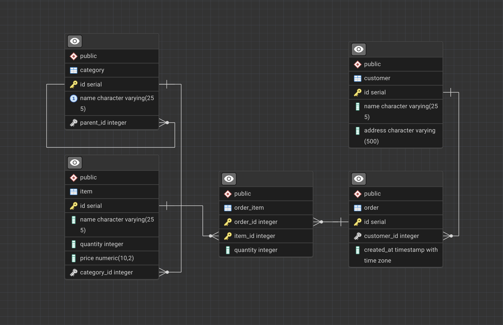

# Product Order API

REST API for add products in orders with hierarchical category catalog support.

## Database Structure



## SQL Queries

The following queries are implemented in the [queries/](queries/) directory:

### 2.1 Order Totals by Customer

[queries/2.1.sql](queries/2.1.sql) - information about the sum of products ordered for each customer.

### 2.2 First-Level Child Categories

[queries/2.2.sql](queries/2.2.sql) - number of first-level nested elements for product categories.

### 2.3 Top-5 Products by Month

[queries/2.3.sql](queries/2.3.sql) - VIEW for reporting the most popular products.

**Optimizations for highload:**

1. Add indexes on item(category_id), order_item(item_id), order_item(order_id), order(created_at)
2. The recursive CTE for finding the root category is executed for all categories, not just those in the top 5, which can become a bottleneck with a large number of categories, so better to use a denormalized table and explicitly specify root_category_id for each item
3. Use Materialized VIEW with periodic refresh

## Start API

```bash
cp .env.example .env
docker compose up --build
```

## Testing

```bash
cp .env.example .env
docker compose -f compose.test.yaml run --rm --build backend
docker compose -f compose.test.yaml down
```

## API Documentation

After starting the application, documentation is available at: http://localhost:8000/docs
